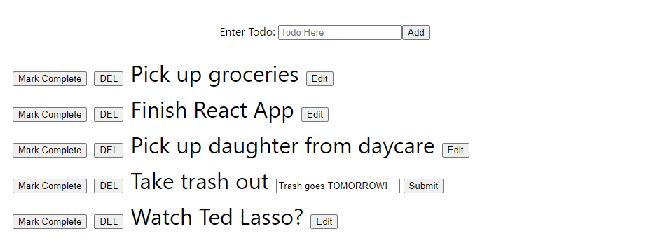

# React - Forms Exercise 2 - Todo App
xyz

  

## Running the App
1) Clone repo: `git clone https://github.com/mpike91/React-FormsExercise2.git`
2) Move into directory: `cd React-FormsExercise2/`
3) Install npm: `npm install`
4) Start app: `npm start`

## My Contribution
xyz
